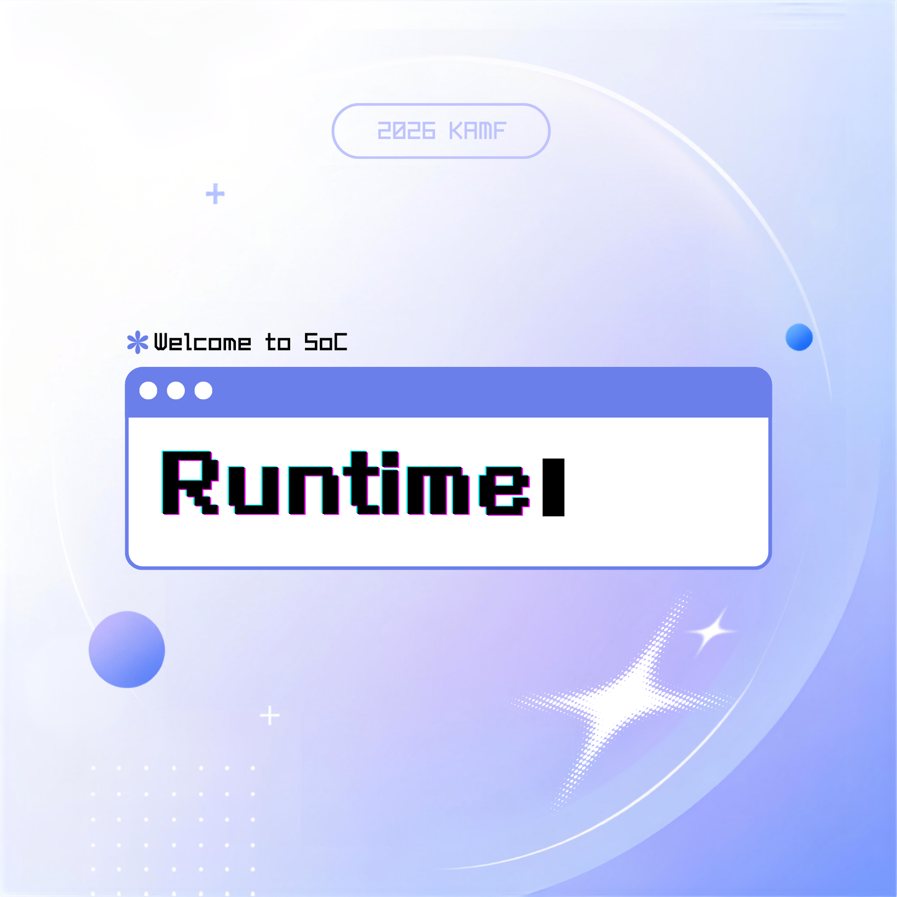

# runtime — 모션 지하철 러너 부스

몸동작(좌/우/점프)으로 즐기는 **Unity WebGL Subway Surfers**. 학생회 이벤트 부스용.
카메라·동작인식(MediaPipe)·게임을 브라우저 한 화면에서 처리하며, **완전 오프라인**으로 동작합니다.

<p align="center"></p>

---

## 필요한 것 (부스 PC)
- **Python 3** (서버 실행용)
- **Chrome** (또는 Chromium 계열 브라우저)
- **웹캠**

인터넷·추가 설치는 필요 없습니다.

## 설치
아래 둘 중 하나:

**A. 배포 zip**
1. [Releases](https://github.com/legojeon/soc-runtime/releases)에서 `soc-runtime.zip` 다운로드 → 압축 풀기 (또는 USB로 부스 PC에 복사)

**B. git clone**
```bash
git clone https://github.com/legojeon/soc-runtime.git
cd soc-runtime
```

## 실행
압축 푼 / clone한 폴더에서:
```bash
python3 serve.py        # Windows: py serve.py
```
그다음 Chrome에서 접속:
```
http://localhost:8000/booth/booth.html
```
- 카메라 권한 **허용**, `F11`로 전체화면.
- ⚠️ 반드시 `serve.py`로 열 것 — `python -m http.server`나 `file://`로 열면 카메라/게임이 안 뜹니다.
  (`.mjs`를 `text/plain`으로 내보내는 Windows 환경에서는 부스 화면 버튼이 전부 먹통이 됩니다. `serve.py`가 MIME을 직접 지정해 막아줍니다.)
- 첫 플레이 때 게임(Unity) 로딩에 몇 초 걸립니다.

## 플레이 방법
1. 메뉴에서 **게임 시작**
2. 카메라 앞 **2~3m**에 전신이 보이게 서고, **가운데서 약 1.5초 정지** → 보정 완료
3. **3 · 2 · 1 카운트다운** 뒤 시작 (카운트다운 동안 게임은 멈춰 있고, 시작 직후 몇 초는 장애물이 나오지 않습니다)
4. **초록색 장애물 = 점프로 넘기**, **빨간색 장애물 = 좌우로 피하기**
5. 몸을 **좌/우로 한 발** = 칸 이동, **살짝 점프** = 점프
6. 목숨·코인·거리·점수는 화면 상단 HUD에 표시, 목숨 다하면 게임오버
   - 점수 = **코인 점수 + 거리 점수**
   - 부딪히면 화면이 흔들리고, 무적(3초) 동안 캐릭터와 화면 테두리가 깜박입니다(끝날수록 빨라짐)

## 담당자 조작 (화면 버튼)
플레이 중 화면 버튼(클릭):
- **↻ 재시도** — 보정 유지하고 새 판 시작(죽었을 때 빠르게)
- **⟲ 재보정** — 다음 플레이어용(키·위치 다시 맞춤)
- **≡ 메뉴** — 시작 화면으로

## 설정
메뉴 → **설정**에서 실시간 조정:
- **게임 속도** — 게임이 흘러가는 속도
- **이동 속도** — 칸 사이를 옮겨가는 속도
- **좌우 민감도** / **점프 민감도** — 1~10. **오른쪽(숫자가 클수록) 조금만 움직여도 반응**합니다.
- **미리보기 위치** — 플레이 중 카메라 화면이 붙을 구석

값은 브라우저에 저장되어 유지됩니다.
민감도는 **다음 보정부터** 적용되니, 바꾼 뒤에는 `⟲ 재보정`을 눌러주세요.

## 게임 수정·다시 빌드하기 (선택)
게임 소스와 WebGL 빌드가 모두 저장소에 들어있습니다.
- `game-unity/project/` — Unity 프로젝트 원본 (캐릭터·장애물·조작 로직)
- `game-unity/Build/` — 부스가 실제로 실행하는 WebGL 빌드 결과

빌드 환경:
- **Unity 6000.3.7f1** — Unity Hub에서 이 버전으로 열기
- WebGL Build Support 모듈 필요
- 주요 패키지: FBX Importer(4.2.1), TextMeshPro(3.0.6) 등 (`Packages/manifest.json`이 자동 복원)

수정 순서:
1. Unity Hub → `game-unity/project/` 폴더 열기 (첫 실행 시 `Library/` 재생성에 시간이 걸립니다)
2. 캐릭터/장애물/텍스처/스크립트 수정
3. **File → Build Settings → WebGL → Build**
4. 빌드 산출물을 `game-unity/Build/`에 덮어쓰기
   - 부스 셸은 Unity 기본 출력 이름(`Build.loader.js` / `Build.data.gz` /
     `Build.framework.js.gz` / `Build.wasm.gz`)을 그대로 읽습니다. **이름을 바꾸거나
     한 단계 더 깊은 폴더에 넣지 마세요.** 빌드 폴더 이름을 `Build`로 두면 그대로 맞습니다.
   - 옛 빌드 파일이 남아 있으면 부스가 그쪽을 계속 읽어 새 빌드가 반영되지 않은 것처럼 보입니다.

부스 셸(`booth/`)·조작 코드는 그대로 재사용됩니다. Unity↔셸 연동은 `Assets/Scripts/BoothBridge.cs`(WebGL로 `MoveLeft`/`MoveRight`/`Jump`/`Restart` 수신)를 참고하세요.

### 게임플레이 조정 지점 (Inspector)
- `ObstaclePool` — **장애물 색 구분 (초록 = 넘기 / 빨강 = 피하기)**
  색은 이름이 아니라 **크기 조정이 끝난 뒤 실제로 잰 높이**로 정합니다. 기준선도
  `PlayerController.JumpClearanceHeight`(실제 점프력·질량·중력·콜라이더에서 계산)를 쓰기 때문에,
  **초록으로 칠해진 장애물은 실제로 넘어간다는 게 보장**됩니다. 아래 값을 바꾸면 색과 높이가 함께 따라옵니다.
  - `_jumpableObstacleNames` 어떤 장애물을 "넘는" 쪽으로 만들지 (기본: Primitive_Cylander, Tube, Small Car, Crate).
    씬에 장애물을 추가하면 여기도 갱신하세요.
  - `_extraClearance` (기본 0.15) 계산 기준선에 더할 여유. **실제 플레이가 계산보다 관대하면 여기를 올리세요.**
  - `_lowObstacleMargin` (기본 0.35) 초록 장애물을 기준선보다 얼마나 더 낮출지 — 타이밍 여유
  - `_tallObstacleMinTopY` (기본 2.0) 빨강 장애물의 최소 높이
  - `_resizeObstacles` 끄면 높이는 그대로 두고 색만 칠합니다(색은 여전히 실측 기준이라 정확합니다)
  - `_boothObstacleTuning` 끄면 원본 씬 그대로
- `GameManager._obstacleGraceSeconds` (기본 4) 시작 직후 장애물이 나오지 않는 시간
- `PlayerController._flashingAnimationDuration` (기본 3) 피격 후 무적 시간.
  **바꾸면 `booth/shell.mjs`의 `INVINCIBLE_MS`도 같은 값으로 맞춰야** 화면 테두리 깜박임이 실제 무적과 어긋나지 않습니다.
- `NubzukiFlash` — 무적 동안 캐릭터 깜박임 속도(`_blinkIntervalStart` → `_blinkIntervalEnd`로 점점 빨라짐)

## 폴더 구성
```
booth/            부스 셸(메뉴/보정/플레이 UI + 동작인식 + Unity 조작)
game-unity/
  ├─ project/   Unity 프로젝트 원본(2022.3.0f1) — 게임 수정용
  └─ Build/     Unity WebGL 게임 빌드(부스 실행본, Build.* 4개 파일)
vendor/           MediaPipe(오프라인 번들)
serve.py          로컬 서버(Unity gzip 헤더 + MIME 처리)
tests/            판정 로직 단위 테스트 (npm test / node --test)
```

## 라이선스 / 크레딧
[CREDITS.md](CREDITS.md) 참고. 게임은 Ezgi Keserci의 Subway Surfers Clone(MIT), 동작인식은 Google MediaPipe(Apache-2.0)를 사용합니다.

## 테스트
```bash
npm test        # 또는 node --test
```
`booth/`의 순수 판정 로직(보정·레인·점프·설정 매핑)을 검증합니다. 브라우저나 Unity 없이 돕니다.
